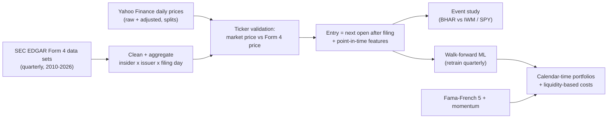

# Insider Trading Alpha

**Do corporate insiders' open-market purchases predict stock returns, and can an outsider still profit from them after costs?**

> **Headline:** insider purchases are informative (**{{b5}} abnormal return in 5 days, t = {{t5}}**), but {{priced_before}} is priced in before an outsider can trade. A walk-forward gradient-boosting model ranks them out of sample (AUC {{auc}}, rank IC {{ic}}), and its real value is as a filter: the buys it ranks worst earn **{{bot_alpha}} p.a. FF5+momentum alpha (t = {{bot_alpha_t}})**. Copying every insider buy earns no alpha after costs ({{all_alpha}} p.a., t = {{all_alpha_t}}).

| Data | Signal decay | ML model (out of sample) | Tradable result | Copy-all-buys |
|---|---|---|---|---|
| {{n_lines}} Form 4 lines, {{first_filing}} to {{last_filing}} | {{b5}} in 5 days (t = {{t5}}); {{b63}} at 3 months (t = {{t63}}) | AUC {{auc}}, top-bottom decile spread {{dec_spread}} pp over 3 months | Worst-quintile buys: {{bot_alpha}} p.a. alpha (t = {{bot_alpha_t}}) | {{all_alpha}} p.a. alpha (t = {{all_alpha_t}}), net |

An end-to-end, point-in-time research pipeline built on **{{n_lines}} SEC Form 4 transaction lines** (every open-market purchase and sale filed {{first_filing}} to {{last_filing}}). It covers event studies, insider-skill tests, a walk-forward machine-learning ranking model and calendar-time portfolio backtests with realistic costs.

> Every number below is produced by `python scripts/run_pipeline.py` and inserted by `scripts/make_readme.py`. Nothing is typed by hand.

## Key findings

| | Result |
|---|---|
| **Insider purchases carry information** | Stocks earn **{{b5}}** abnormal return (vs IWM) in the 5 days after we can trade (t = {{t5}}). This is significant in {{years_pos5}} calendar years. |
| **...but most of it is gone before an outsider can act** | **{{pre_filing}}** accrues between the insider's trade and the filing, and another **{{overnight}}** overnight after the filing, so **{{priced_before}}** is priced before the next open. |
| **The longer-run drift is weak** | Abnormal return is {{b63}} at 3 months (t = {{t63}}) and {{b126}} at 6 months (t = {{t126}}). Sales carry no signal ({{sell63}}, t = {{sell63t}}). |
| **Who is informative** | *Opportunistic* insiders (Cohen, Malloy & Pomorski 2012) drift for months: {{opp63}} at 3 months (t = {{opp63t}}), {{opp126}} at 6 months (t = {{opp126t}}). |
| **ML separates winners from losers** | Walk-forward gradient boosting reaches out-of-sample AUC {{auc}} and rank IC {{ic}}. The top score decile earns {{dec10}} and the bottom decile {{dec1}} over 3 months, a **{{dec_spread}} pp spread**. |
| **The strongest tradable result is knowing what to avoid** | Insider buys in the model's bottom quintile have FF5+momentum alpha of **{{bot_alpha}} p.a. (t = {{bot_alpha_t}})**. |
| **Naively copying insiders doesn't pay** | Buying every investable insider purchase gives FF5+momentum alpha of {{all_alpha}} p.a. (t = {{all_alpha_t}}) after costs. A 5-day hold has Sharpe {{h5_gross}} gross but only {{h5_net}} net. |
| **Long-only ML portfolio** | Top-quintile portfolio: Sharpe {{top_sharpe}} (95% CI {{top_ci}}) vs {{iwm_sharpe}} for IWM, alpha {{top_alpha}} (t = {{top_alpha_t}}) and market beta {{top_beta}}. It's mostly small-cap beta. |
| **Market-neutral ML spread** | Long top / short bottom quintile: Sharpe {{ls_gross}} gross, **{{ls_sharpe}} net** of short-side costs and 3% borrow fee, alpha {{ls_alpha}} (t = {{ls_alpha_t}}), beta {{ls_beta}}. |

**Bottom line:** the insider signal is real and statistically robust, but it is fast and small. After you account for when outsiders can actually trade, transaction costs and factor exposures, it is most useful as a **filter**: avoiding the insider purchases the model flags as losers. It is not a stand-alone long-only strategy.

## Pipeline



**Data:** {{n_buy_events}} purchase events and {{n_sell_events}} sale events (2010 to 2026). {{n_buy_tradeable}} purchases have validated prices and a tradeable entry; see `results/data_coverage.csv`.

- **Source.** Filings come from the SEC's official Form 3/4/5 data sets, so the sample is complete and reproducible. Only original (not amended) Form 4s are used, and only open-market purchases (code `P`) and sales (code `S`) of common stock. Funds, SPACs and preferred stock are excluded.
- **One event.** An event is one insider buying one company's stock on one filing day; partial fills are combined.
- **Ticker matching.** Tickers are matched using both the symbol on the filing and the company's current ticker, which catches renames such as FB to META. A match is **accepted only if the market price on the trade date is within 30% of the price the insider reported.** This rejects recycled tickers and bad split data.
- **Coverage.** {{coverage}} of purchase events end up with validated prices and a tradeable entry. Of the rest, {{miss_delisted}} are companies that no longer exist (delisted or acquired), which Yahoo doesn't serve (see Limitations).

## 1 · Event study


Mean buy-and-hold abnormal return vs IWM from the open of the session **after** the filing date. Values are winsorised at 1%/99%; t-statistics are clustered by filing month.

{{table_event}}

**Who captures the return?** All purchase events:

{{table_timeline}}


## 2 · Is insider skill persistent?

Do some insiders have persistent skill? An insider's track record uses **only earlier purchases whose 3-month outcome window had already closed** before the new filing.

- Insiders in the top quintile of past performance earn {{q5_future}} (t = {{q5_t}}) on their next purchase, against {{q1_future}} for the bottom quintile. The Q5 minus Q1 spread has t = {{skill_spread_t}}.
- In Fama-MacBeth regressions with controls, a one-standard-deviation better track record adds {{fm_coef}} (t = {{fm_t}}).
- Skill persistence is therefore weak: measured point-in-time, an insider's past winners say little about their next purchase.


## 3 · Walk-forward ML ranking

- **Setup.** 31 point-in-time features, grouped as:
  - trade: size, holdings change, filing lag, indirect ownership
  - insider: role, routine vs opportunistic, track record
  - activity: cluster buying, insider selling
  - stock: momentum, volatility, 52-week range, liquidity
  - market: SPY return and volatility
- **Label.** 63-day abnormal return > 0.
- **Retraining.** Every quarter, on labels that were already realised. The first prediction is for {{oos_start}}.
- **Trading rule.** The top-20% threshold comes from the training-period score distribution, so no future information is used.
- **Model choice.** The primary model (gradient boosting) was fixed in `config.py` before any out-of-sample results were seen.

{{table_models}}


## 4 · Portfolio backtest ({{oos_start}} to {{oos_end}})

- **Entry and hold.** Enter at the next open after the filing and hold 63 sessions; positions drift with their own prices, and the portfolio is not rebalanced daily.
- **Costs.** One-way costs by 20-day average dollar volume: **60 bps** (under $1M/day) down to **5 bps** (over $100M/day), charged on both entry and exit.
- **Universe.** Price at least $2 and dollar volume at least $250k per day.
- **Statistics.** Sharpe confidence intervals come from a block bootstrap. The deflated Sharpe ratio adjusts for all variants tried; the ML top-quintile's deflated Sharpe gives a {{top_dsr}} probability that its true Sharpe is above zero.

{{table_backtest}}


**Holding-period robustness.** Net Sharpe (gross in brackets). This analysis was run after seeing the event study, so treat it as descriptive rather than a strategy choice:

{{table_hold}}

## Biases handled

| Pitfall | How this project handles it |
|---|---|
| Look-ahead in features | Every feature is point-in-time (track records use only closed outcome windows); unit tests enforce it (`tests/`) |
| Trading before the information is public | Entry at the open of the session *after* the filing date |
| Wrong or recycled tickers | A ticker is accepted only if the market price matches the price the insider reported (within 30%) |
| Overlapping returns inflating the Sharpe ratio | Daily calendar-time portfolio P&L |
| Ignoring costs and factor exposure | IWM/SPY benchmarks, Fama-French 5 + momentum alpha, liquidity-based costs, cost sensitivity |
| Data snooping across variants | Walk-forward only; model fixed in advance; deflated Sharpe over all variants tried |

## Limitations

- **Survivorship.** Free Yahoo data lacks most delisted stocks: {{miss_delisted}} of the unpriced purchase events are at companies that no longer exist. The sample is therefore biased towards survivors, which likely *flatters* the long-only results. The negative bottom-quintile result is probably understated rather than overstated, since delisted firms tend to be the worst performers. CRSP (via WRDS) would fix this, and the loaders only need a date × ticker price table.
- **Filing time.** Filing timestamps are daily. Entering at the next open is conservative for after-hours filings but gives up intraday reactions.
- **Mixed transactions.** Code `P` also includes some private placements. 10b5-1 plan flags only exist from 2023, so they are not used.
- **Costs.** The cost model is a schedule, not a market-impact model. The short leg assumes shares can be borrowed at 3% p.a.

## Reproduce

```bash
pip install -r requirements.txt
python scripts/download_data.py --email you@example.com   # ~1 h: SEC data sets, prices, factors -> data/raw/
python scripts/run_pipeline.py                            # build + analyse -> results/
python scripts/make_readme.py                             # refresh README numbers
python tests/test_pipeline.py                             # or: pytest tests
```

```
src/insider_alpha/
  events.py     Form 4 cleaning, event aggregation, ticker validation, entry timing
  features.py   point-in-time stock, activity, role and track-record features
  returns.py    event return paths and BHARs
  model.py      walk-forward training, OOS metrics, permutation importance
  backtest.py   calendar-time portfolio with liquidity-based costs
  stats.py      Newey-West, clustered t-stats, bootstrap and deflated Sharpe
  analysis.py   event study, skill persistence, models, backtests, figures
notebooks/      walkthrough notebook (reads results/)
results/        CSV tables + figures (committed)
tests/          look-ahead and P&L unit tests + synthetic end-to-end test
```

## References

- Lakonishok & Lee (2001), *Are Insider Trades Informative?*, Review of Financial Studies.
- Cohen, Malloy & Pomorski (2012), *Decoding Inside Information*, Journal of Finance.
- Lyon, Barber & Tsai (1999), *Improved Methods for Tests of Long-Run Abnormal Stock Returns*, Journal of Finance.
- Bailey & López de Prado (2014), *The Deflated Sharpe Ratio*, Journal of Portfolio Management.
- López de Prado (2018), *Advances in Financial Machine Learning*.
