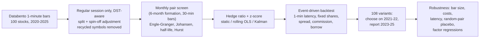

# Intraday Statistical Arbitrage: Cointegration Pairs Trading

**Can a market-neutral pairs portfolio, selected with cointegration tests on 1-minute data for 100 US stocks, earn a positive risk-adjusted return out of sample after realistic costs? And does trading at higher frequency help?**

> **Headline:** the best of 108 pre-specified variants on 2021-22 data (net Sharpe 1.66) earned a net Sharpe of **0.39 out of sample in 2023-25**, with beta 0.11 to the S&P 500. The average of all 108 variants lost money out of sample (Sharpe -0.92).
> The edge is thin because cointegration is barely present in this universe. Only **5.8%** of within-industry pair-months pass a 5% test, against **5.2%** for unrelated random walks, and just 9 of 5,765 survive false-discovery control. Intraday bars (1 minute to 1 hour) show almost no gross edge (average gross Sharpe at most 0.06).

| Data | Pair screen | Validation, 2021-22 | Out of sample, 2023-25 | Robustness |
|---|---|---|---|---|
| 100 stocks, 462,330 regular-session minutes, 2020-11-06 to 2025-11-05 | 5,765 pair-months tested; 5.8% pass at 5% (chance: 5.2%); 9 FDR discoveries | Net Sharpe 1.66; deflated-Sharpe probability 0.87 | Net Sharpe **0.39** [-0.73, 1.52], max drawdown -10%, beta 0.11 | 19 of 108 variants profitable OOS; the strategy beats 83% of random-pair portfolios |

This is an end-to-end, walk-forward research pipeline:
- 5 years of Databento 1-minute bars
- ADF, Engle-Granger and Johansen tests implemented from scratch and validated by Monte Carlo
- static, rolling and Kalman-filter hedge ratios
- an event-driven backtester with one-minute execution latency, tick-size-aware costs and borrow fees
- a pre-registered validation / out-of-sample protocol

> Every number below is produced by `python scripts/run_pipeline.py` and inserted by `scripts/make_readme.py`. Nothing is typed by hand.

## Key findings

| | Result |
|---|---|
| **Cointegration is rare, and it doesn't last** | Only 5.8% of within-industry pair-months have an Engle-Granger p-value below 5%, against 5.2% for simulated unrelated random walks (2.0% vs 0.9% at 1%). Of the pairs that passed every filter, only 10.4% were still significant over the next 6 months (other candidates: 5.2%). Their median half-life also lengthened from 2.8 to 7.1 trading days. |
| **The validation winner decayed** | Rolling OLS hedge, 1 day bars, enter at z = ±2, exit at ±0.5 had the best 2021-22 net Sharpe (1.66, 95% CI [0.71, 2.63]). Out of sample it made 0.39 (CI [-0.73, 1.52]). Across the 108 variants, validation and out-of-sample Sharpe have a rank correlation of only 0.32, and after deflating for 108 trials the probability that the winner's true Sharpe was above zero is 0.87, short of the usual 95% bar. |
| **The strategy family loses money out of sample** | Averaging all 108 variants gives an OOS Sharpe of -0.92. Only 19 of 108 (18%) made money. Over the same period SPY had a Sharpe of 1.16. |
| **It is market-neutral** | Beta to SPY is 0.10 (correlation 0.20). FF5 + momentum alpha is +15.0% p.a. (t = 2.4) in validation and +1.6% (t = 0.3) out of sample. |
| **Higher frequency doesn't help** | Averaged over all variants, 1-minute bars have a gross Sharpe of -0.04 (net -0.35) against 0.20 (net 0.08) for daily bars. No intraday bar size beats 0.06 gross. With the chosen rules on 1-minute bars, a trade earns -1.2 bps gross but costs 7.4 bps. |
| **Costs and latency** | The chosen strategy pays 4.1 bps per leg per fill on average. It breaks even at 7.8x base costs over the full sample (about 32 bps per leg), but only 3.9x out of sample. Filling at the signal bar's own close (no delay) instead of the first trade after it gives a Sharpe of 0.48 instead of 0.86; waiting a whole bar gives 0.44. |
| **Statistical screen vs random pairs** | The strategy beats 100% of 100 random same-industry portfolios over the full sample and 83% out of sample, using identical rules. The classic distance method made -0.66 out of sample. |
| **Where it broke** | Net return by year: 2021 +11.2%, 2022 +13.0%, 2023 +8.2%, 2024 +2.5%, 2025 -1.8%. Semiconductor pairs went from +4.5% of capital in validation to -10.2% out of sample, as the AI boom split the sector into winners and losers. |

**Bottom line:** with honest selection and costs, cointegration-based pairs trading on these stocks was a weak, fading edge rather than a durable one. The lessons are about process:
- Test whether the relationship you trade is more common than chance.
- Choose parameters on one period and report another.
- Compare against random pairs and the average of every variant tried, not just the winner.
- Check whether higher frequency adds gross edge faster than it adds costs. Here it did not.

## Pipeline



## Data

- **Source.** Databento Nasdaq TotalView-ITCH 1-minute OHLCV bars for 100 US stocks, 2020-11-06 to 2025-11-05 (1,255 trading days).
  - The tickers cover 21 hand-labelled industries, such as semiconductors, bitcoin miners, interactive media, pharma, fintech and solar.
  - See `data/README.md`.
- **Regular session only, DST-aware.** The vendor files stop at 20:00 UTC. That is 16:00 New York time in summer but 15:00 in winter, so 422 standard-time days lack the last trading hour for every stock.
  - Each day's session end is detected from the data, and no bar spans the gap.
  - The final hour's return on those days is part of the overnight move.
- **Corporate actions.** 22 splits and spin-offs are back-adjusted, e.g. GOOGL 20-for-1 (fig. 10), NVDA, AVGO and reverse splits.
  - Every overnight move above 45% is audited in `results/data_split_audit.csv`. This audit found one split missing from the Yahoo history (NVO, 2-for-1, 2023).
- **Recycled symbols.** `META` belonged to a Roundhill ETF until 9 June 2022, and `BHVN` passed to Biohaven's spin-off in October 2022. Data before those dates is dropped.
- **Cross-check.** On full-session days the last regular-session trade matches Yahoo's official close to within a median of 4.0 bps.


## 1 · Pair selection (every month, point-in-time)

1. **Formation window.** The previous 6 months of **30-minute** log prices, split-adjusted.
   - Unit-root test power depends on the calendar span rather than the sampling frequency, so one selection bar size serves every trading frequency.
2. **Universe.** Stocks that traded on at least 95% of formation days, with a median price of at least $3 and a median Nasdaq dollar volume of at least $5M per day. Everything is measured inside the window.
3. **Candidates.** Every pair of universe stocks in the same industry.
4. **Engle-Granger test** in both orderings. The pair's p-value is 2x the smaller one (Bonferroni for the two orderings).
5. **Eligibility.** A pair must have p <= 5%, a Johansen trace test that rejects no cointegration, an Ornstein-Uhlenbeck half-life between 2 hours and 10 days, a Hurst exponent below 0.5, and a hedge ratio between 0.2 and 5.
   - The Johansen test puts the constant inside the cointegrating relation. Its critical values are checked by simulation in `tests/`.
6. **Ranking.** Pairs are ranked by p-value. Up to **5 pairs** are traded, with no stock in more than 2 of them.

| Step | Pair-months |
|---|---:|
| Within-industry candidate pair-months | 5,765 |
| Engle-Granger p <= 5% (both orderings, Bonferroni) | 334 |
| ... and Johansen trace test rejects r = 0 | 216 |
| ... and half-life 2 h - 10 days | 216 |
| ... and Hurst < 0.5 and plausible hedge ratio (eligible) | 137 |
| Selected (top 5 / month, ticker cap) | 117 |
| Benjamini-Hochberg discoveries at 5% FDR (all candidates) | 9 |

On average only **2.2 pairs** qualify per month, so about 43% of capital is deployed. 4 of 54 months have no pair at all.


**Does cointegration persist?** Each pair was re-tested on the following 6 months (out of sample for the test itself):

| Formation-window result | Pairs re-tested | Still p <= 5% next 6 months | Median half-life then -> next (days) |
|---|---:|---:|---:|
| Other candidates (random sample) | 960 | 5.2% | 8.3 -> 8.0 |
| Eligible (passed all filters) | 115 | 10.4% | 2.8 -> 7.1 |


## 2 · Backtest design

- **Walk-forward.** Pairs chosen at the start of month *m* trade only during month *m*, and every position is closed at the month-end close.
- **Signals.** Z-score of the spread `log P_y - beta * log P_x`, with three hedge-ratio methods:
  - *static*: formation OLS;
  - *rolling*: OLS over the previous 10 trading days (at least 20 bars, so 20 days for daily bars), with the current bar scored out of sample;
  - *Kalman*: random-walk state for the hedge ratio and mean, with noise scaled so the filter has about a 10-day memory at any bar size.
- **Rules.**
  - Enter when |z| exceeds the entry threshold.
  - Exit when z crosses back through the exit threshold, at a stop-loss (|z| >= entry + 2), after 3 formation half-lives, or at month end.
  - After a stop, the pair can re-enter only once |z| is back inside the entry band.
- **Execution.**
  - The signal uses the bar's close.
  - The order fills at the **close of the next 1-minute bar**, i.e. the next traded price. Month-end exits use the closing price.
  - Share quantities are fixed at entry ($1 long : $beta short, gross exposure 2x slot capital) and never rebalanced mid-trade.
- **Costs**, per leg and per fill:
  - half-spread, estimated monthly with the Abdi-Ranaldo estimator on 1-minute bars and floored at half a tick;
  - $0.0035 per share commission;
  - 1 bp impact;
  - plus a 1% p.a. borrow fee on the short leg.
- **Returns.** Daily P&L on committed capital, excluding interest on that capital. It is therefore an excess return, and the Sharpe ratio uses no risk-free deduction.
- **Protocol.** 108 variants: 6 bar sizes (1 min to 1 day) x 3 hedge methods x entry |z| in {1.5, 2, 2.5} x exit |z| in {0, 0.5}.
  - The grid, the selection rules and the cost model were fixed before any backtest.
  - The variant with the best **validation** (2021-05 to 2022-12) net Sharpe is reported **out of sample** (2023-01 to 2025-10).

## 3 · Results

Chosen on validation: **Rolling OLS hedge, 1 day bars, enter at z = ±2, exit at ±0.5**. It made 147 trades (2.7 per month), won 58% of them, and held for a median of 5.0 calendar days.
- Gross P&L per trade fell from 95 bps of the position's gross notional in validation to 41 bps out of sample. Costs averaged 8 bps.
- Exits: 58% reversion, 10% stop-loss, 16% time stop, 16% month end.

| Period | Series | CAGR | Vol | Sharpe | Sharpe 95% CI | Max DD | FF5+Mom alpha p.a. (t) | Beta to SPY |
|---|---:|---:|---:|---:|---:|---:|---:|---:|
| Validation (2021-05 to 2022-12) | Strategy, net | 14.6% | 8% | 1.66 | [0.71, 2.63] | -7% | +15.0% (2.4) | 0.09 |
|  | Strategy, gross | 15.8% | 8% | 1.78 | [0.86, 2.76] | -6% | +16.0% (2.5) | 0.09 |
|  | Average of all 108 variants, net | 5.4% | 5% | 1.02 | [-0.30, 2.23] | -5% | +5.7% (1.6) | 0.05 |
|  | SPY buy & hold | -3.6% | 20% | -0.12 | [-1.32, 1.33] | -24% |  | 1.00 |
| **Out of sample (2023-01 to 2025-10)** | Strategy, net | 3.1% | 9% | 0.39 | [-0.73, 1.52] | -10% | +1.6% (0.3) | 0.11 |
|  | Strategy, gross | 4.4% | 9% | 0.54 | [-0.59, 1.67] | -9% | +2.8% (0.5) | 0.11 |
|  | Average of all 108 variants, net | -6.6% | 7% | -0.92 | [-2.12, 0.03] | -22% | -7.4% (-1.7) | 0.03 |
|  | SPY buy & hold | 24.4% | 16% | 1.16 | [0.12, 2.28] | -19% |  | 1.00 |
| Full walk-forward | Strategy, net | 7.2% | 9% | 0.86 | [0.04, 1.61] | -10% | +6.9% (1.7) | 0.10 |
|  | Strategy, gross | 8.5% | 9% | 1.00 | [0.19, 1.75] | -9% | +8.1% (2.0) | 0.10 |
|  | Average of all 108 variants, net | -2.3% | 6% | -0.32 | [-1.25, 0.45] | -22% | -2.0% (-0.6) | 0.04 |
|  | SPY buy & hold | 13.1% | 17% | 0.60 | [-0.21, 1.48] | -24% |  | 1.00 |


**Validation vs out of sample for all 108 variants.** Most variants that looked good in 2021-22 lost money afterwards:


Top variants by validation Sharpe:

| Bar | Hedge | Entry z | Exit z | Validation Sharpe | OOS Sharpe | Trades |
|---|---:|---:|---:|---:|---:|---:|
| 1 day | Rolling OLS | 2 | 0.5 | 1.66 | 0.39 | 147 |
| 1 min | Static OLS | 2 | 0 | 1.31 | -0.09 | 153 |
| 1 min | Static OLS | 2.5 | 0 | 1.23 | -0.51 | 108 |
| 1 day | Rolling OLS | 2 | 0 | 1.18 | 0.24 | 143 |
| 1 hour | Rolling OLS | 1.5 | 0.5 | 1.18 | -1.50 | 506 |
| 1 day | Kalman filter | 1.5 | 0.5 | 1.18 | -0.49 | 182 |
| 1 min | Static OLS | 1.5 | 0 | 1.16 | -0.21 | 222 |
| 5 min | Rolling OLS | 1.5 | 0.5 | 1.14 | -1.58 | 820 |

| Year | Strategy net | Sharpe | All 108 variants net | SPY |
|---|---:|---:|---:|---:|
| 2021 (May-Dec) | +11.2% | 2.35 | +4.3% | +15.0% |
| 2022 (Jan-Dec) | +13.0% | 1.35 | +4.7% | -18.2% |
| 2023 (Jan-Dec) | +8.2% | 1.29 | -0.5% | +26.2% |
| 2024 (Jan-Dec) | +2.5% | 0.48 | -4.6% | +24.9% |
| 2025 (Jan-Oct) | -1.8% | -0.10 | -13.0% | +17.4% |

## 4 · What drives the result?

**Bar size.** The same pairs are traded with signals and fills at each bar size. Columns marked * use the chosen entry/exit rules.

| Bar size | Gross Sharpe (avg of 18) | Net Sharpe (avg of 18) | OOS net (avg of 18) | Trades / month* | Gross bps / trade* | Cost bps / trade* | Break-even cost / leg* |
|---|---:|---:|---:|---:|---:|---:|---:|
| 1 min | -0.04 | -0.35 | -0.82 | 11.4 | -1.2 | 7.4 | none |
| 5 min | -0.07 | -0.33 | -0.85 | 8.9 | -8.8 | 7.9 | none |
| 15 min | 0.06 | -0.17 | -0.55 | 7.9 | -2.4 | 7.7 | none |
| 30 min | -0.01 | -0.22 | -0.62 | 7.1 | -2.2 | 7.7 | none |
| 1 hour | -0.05 | -0.25 | -0.69 | 6.3 | -4.1 | 7.7 | none |
| 1 day | 0.20 | 0.08 | -0.22 | 2.7 | 65.1 | 8.2 | 32 bps |


**Hedge-ratio method** (average of variants):

| Hedge ratio | Validation net (all bars) | OOS net (all bars) | OOS gross (all bars) | OOS net (1 day bars) |
|---|---:|---:|---:|---:|
| Kalman filter | 0.47 | -0.70 | -0.44 | -0.39 |
| Rolling OLS | 0.72 | -0.99 | -0.68 | 0.28 |
| Static OLS | 0.79 | -0.18 | -0.07 | -0.56 |

**Costs.** Net Sharpe of the chosen strategy as all trading costs are scaled:


**Execution latency** (chosen strategy). With daily bars, "one minute after the close" means the next morning's first trade:

| Order filled | Net Sharpe (full) | Gross Sharpe (full) | Net Sharpe (OOS) |
|---|---:|---:|---:|
| At the signal bar's closing price (no delay, optimistic) | 0.48 | 0.62 | -0.13 |
| Close of the next 1-minute bar (base case) | 0.86 | 1.00 | 0.39 |
| 5 minutes after the signal | 0.89 | 1.03 | 0.42 |
| 15 minutes after the signal | 0.80 | 0.94 | 0.37 |
| Close of the next bar | 0.44 | 0.58 | -0.07 |

**Pair selection vs placebo.** The trading rules stay identical and only the choice of pairs changes. The "any industry" screen was *not* chosen: its validation Sharpe was only 1.11. Its strong out-of-sample number is a hypothesis for further testing, not a result.

| Pair selection (same trading rules) | Validation | Out of sample | Full sample |
|---|---:|---:|---:|
| Cointegration, within industry (strategy) | 1.66 | 0.39 | 0.86 |
| Distance / SSD (Gatev et al.) | 0.77 | -0.66 | -0.11 |
| Cointegration, any industry | 1.11 | 1.58 | 1.36 |
| Random within-industry pairs (median of 100) | 0.10 | -0.06 | 0.00 |


**By industry** (chosen strategy, net P&L as % of capital):

| Industry | Trades (val / OOS) | Net P&L, validation | Net P&L, OOS |
|---|---:|---:|---:|
| Semiconductors | 27 / 21 | +4.5% | -10.2% |
| Pharma | 0 / 2 | +0.0% | -1.2% |
| Bitcoin miners / hosting | 0 / 10 | +0.0% | -0.2% |
| Solar | 1 / 0 | +0.7% | +0.0% |
| Travel | 1 / 0 | -0.4% | +0.0% |
| Household products | 0 / 4 | +0.0% | +0.3% |
| Ride-hailing | 0 / 3 | +0.0% | +0.3% |
| Tech hardware | 0 / 2 | +0.0% | +1.2% |
| Biotech | 0 / 2 | +0.0% | +1.5% |
| Interactive media | 23 / 18 | -1.7% | +1.8% |
| Fintech | 2 / 2 | +3.2% | +2.9% |
| EVs, autos & batteries | 4 / 7 | +4.0% | +4.9% |
| Software | 8 / 10 | +13.1% | +8.4% |

## 5 · Example: GOOG vs GOOGL

The two Alphabet share classes are the textbook "pair". They still drift apart, and the class C premium reached about 4% in mid-2021 (fig. 10). Below is the chosen strategy's busiest out-of-sample pair-month:


## Biases handled

| Pitfall | How this project handles it |
|---|---|
| Look-ahead in signals | Signals use data up to the bar close and fills happen one minute later. A unit test perturbs future prices and checks that no past decision changes. |
| Selection look-ahead | Pairs, hedge ratios, half-lives and cost estimates come only from data before the trading month. |
| Data snooping | 108 variants were fixed in advance, chosen on validation only, and reported out of sample. The deflated Sharpe ratio and the average of all variants are reported too. |
| Multiple testing in pair selection | Direction-adjusted p-values, a comparison with a simulated null, Benjamini-Hochberg discovery counts, and a random-pair placebo. |
| Unadjusted or wrong prices | Split and spin-off adjustment, an audit of large overnight moves, recycled symbols dropped, and a cross-check against Yahoo closes. |
| Unrealistic costs | Spreads are floored at half a tick, plus per-share commission, impact and borrow fees, with a cost sensitivity and break-even analysis. |

## Limitations

- **Universe.** The 100 stocks were chosen in 2025. They are liquid, often volatile names, and their selection may favour stocks that became popular, a mild survivorship bias. Industry labels are hand-assigned from current business lines.
- **Single venue.** Nasdaq-only (ITCH) trades understate volume and can differ from consolidated prices by a tick. There are no quotes, so spreads are estimated from bars.
- **Missing final hour.** The final trading hour is missing on standard-time days (see Data). Positions are held through it, so that hour's return is effectively part of the overnight move.
- **Sample size.** Out-of-sample inference rests on under 3 years of daily P&L from about 2 pairs at a time. Every Sharpe confidence interval is wide.
- **Scope.** There is no earnings-date filter and no short-sale availability data. Borrow is a flat 1% p.a., which is optimistic for hard-to-borrow names.
- **Dividends are not adjusted for.** This matters most for dividend payers held over an ex-date, such as pharma, banks and food; the effect partly cancels between the long and short legs.
- **Spread estimates.** The 1-minute Abdi-Ranaldo estimate is often zero, and then the half-tick floor sets the cost. With quote data, the spread could be measured directly.

## Reproduce

```bash
pip install -r requirements.txt
python scripts/download_data.py --databento-key YOUR_KEY   # minute bars (paid), Yahoo splits/closes, factors
# (already have the CSVs? set PAIRS_MINUTE_DIR=/path/to/csvs and run download_data.py --skip-minute)
python scripts/build_data.py                               # ~2 min: clean minute panel -> data/processed/
python scripts/run_pipeline.py                             # ~20 min: selection, 108-variant grid, experiments
python scripts/make_readme.py                              # refresh README numbers
python tests/test_pairs.py                                 # or: pytest tests
```

```
src/pairs/
  data.py        CSV parsing, session detection, split adjustment, minute panel, resampling + fill prices
  coint.py       ADF, Engle-Granger, Johansen (from scratch), half-life, Hurst, Benjamini-Hochberg
  selection.py   point-in-time universe, candidate pairs, monthly screen and ranking rules
  hedge.py       static OLS, rolling OLS and Kalman-filter hedge ratios and z-scores
  backtest.py    vectorised event-driven backtester (fills, fixed shares, costs, borrow, trade log)
  costs.py       Abdi-Ranaldo spread estimator and per-leg cost model
  pipeline.py    cached compute stages; analysis.py tables and figures; stats.py inference helpers
notebooks/       walkthrough notebook (reads results/)
results/         CSV tables + figures
tests/           statistical tests vs Monte Carlo, no-look-ahead and P&L accounting tests
```

## References

- Engle & Granger (1987), *Co-integration and Error Correction*, Econometrica.
- Johansen (1991), *Estimation and Hypothesis Testing of Cointegration Vectors*, Econometrica. MacKinnon, Haug & Michelis (1999), *Numerical Distribution Functions of Likelihood Ratio Tests for Cointegration*, JAE.
- MacKinnon (1994, 2010), approximate p-values and critical values for unit-root and cointegration tests.
- Shiller & Perron (1985), *Testing the Random Walk Hypothesis: Power versus Frequency of Observation*, Economics Letters.
- Gatev, Goetzmann & Rouwenhorst (2006), *Pairs Trading: Performance of a Relative-Value Arbitrage Rule*, RFS.
- Avellaneda & Lee (2010), *Statistical Arbitrage in the US Equities Market*, Quantitative Finance.
- Chan (2013), *Algorithmic Trading: Winning Strategies and Their Rationale* (Kalman-filter pairs).
- Abdi & Ranaldo (2017), *A Simple Estimation of Bid-Ask Spreads from Daily Close, High, and Low Prices*, RFS.
- Benjamini & Hochberg (1995); Bailey & López de Prado (2014), *The Deflated Sharpe Ratio*, JPM.
