# Intraday Statistical Arbitrage: Cointegration Pairs Trading

**Can a market-neutral pairs portfolio, selected with cointegration tests on 1-minute data for {{n_tickers}} US stocks, earn a positive risk-adjusted return out of sample after realistic costs? And does trading at higher frequency help?**

> **Headline:** the best of {{n_trials}} pre-specified variants on 2021-22 data (net Sharpe {{val_sharpe}}) earned a net Sharpe of **{{oos_sharpe}} out of sample in 2023-25**, with beta {{oos_beta}} to the S&P 500. The average of all {{n_trials}} variants lost money out of sample (Sharpe {{ens_oos}}).
> The edge is thin because cointegration is barely present in this universe. Only **{{share_p5}}** of within-industry pair-months pass a 5% test, against **{{null_p5}}** for unrelated random walks, and just {{n_bh}} of {{n_pair_months}} survive false-discovery control. Intraday bars (1 minute to 1 hour) show almost no gross edge (average gross Sharpe at most {{g_intra_max}}).

| Data | Pair screen | Validation, 2021-22 | Out of sample, 2023-25 | Robustness |
|---|---|---|---|---|
| {{n_tickers}} stocks, {{n_minutes}} regular-session minutes, {{first_day}} to {{last_day}} | {{n_pair_months}} pair-months tested; {{share_p5}} pass at 5% (chance: {{null_p5}}); {{n_bh}} FDR discoveries | Net Sharpe {{val_sharpe}}; deflated-Sharpe probability {{dsr}} | Net Sharpe **{{oos_sharpe}}** {{oos_ci}}, max drawdown {{oos_dd}}, beta {{oos_beta}} | {{n_pos_oos}} of {{n_trials}} variants profitable OOS; the strategy beats {{placebo_oos}} of random-pair portfolios |

This is an end-to-end, walk-forward research pipeline:
- 5 years of Databento 1-minute bars
- ADF, Engle-Granger and Johansen tests implemented from scratch and validated by Monte Carlo
- static, rolling and Kalman-filter hedge ratios
- an event-driven backtester with one-minute execution latency, tick-size-aware costs and borrow fees
- a pre-registered validation / out-of-sample protocol

> Every number below is produced by `python scripts/run_pipeline.py` and inserted by `scripts/make_readme.py`. Nothing is typed by hand.

## Key findings

| | Result |
|---|---|
| **Cointegration is rare, and it doesn't last** | Only {{share_p5}} of within-industry pair-months have an Engle-Granger p-value below 5%, against {{null_p5}} for simulated unrelated random walks ({{share_p1}} vs {{null_p1}} at 1%). Of the pairs that passed every filter, only {{pers_el}} were still significant over the next 6 months (other candidates: {{pers_ot}}). Their median half-life also lengthened from {{hl_form}} to {{hl_next}} trading days. |
| **The validation winner decayed** | {{config}} had the best 2021-22 net Sharpe ({{val_sharpe}}, 95% CI {{val_ci}}). Out of sample it made {{oos_sharpe}} (CI {{oos_ci}}). Across the {{n_trials}} variants, validation and out-of-sample Sharpe have a rank correlation of only {{rank_corr}}, and after deflating for {{n_trials}} trials the probability that the winner's true Sharpe was above zero is {{dsr}}, short of the usual 95% bar. |
| **The strategy family loses money out of sample** | Averaging all {{n_trials}} variants gives an OOS Sharpe of {{ens_oos}}. Only {{n_pos_oos}} of {{n_trials}} ({{share_pos_oos}}) made money. Over the same period SPY had a Sharpe of {{spy_oos}}. |
| **It is market-neutral** | Beta to SPY is {{full_beta}} (correlation {{full_corr}}). FF5 + momentum alpha is {{val_alpha}} p.a. (t = {{val_alpha_t}}) in validation and {{oos_alpha}} (t = {{oos_alpha_t}}) out of sample. |
| **Higher frequency doesn't help** | Averaged over all variants, 1-minute bars have a gross Sharpe of {{g1m}} (net {{n1m}}) against {{g1d}} (net {{n1d}}) for daily bars. No intraday bar size beats {{g_intra_max}} gross. With the chosen rules on 1-minute bars, a trade earns {{bps1m}} bps gross but costs {{cost1m}} bps. |
| **Costs and latency** | The chosen strategy pays {{leg_cost}} bps per leg per fill on average. It breaks even at {{be_full}}x base costs over the full sample (about {{be_full_bps}} bps per leg), but only {{be_oos}}x out of sample. Filling at the signal bar's own close (no delay) instead of the first trade after it gives a Sharpe of {{lat0}} instead of {{lat1}}; waiting a whole bar gives {{latbar}}. |
| **Statistical screen vs random pairs** | The strategy beats {{placebo_full}} of {{n_placebo}} random same-industry portfolios over the full sample and {{placebo_oos}} out of sample, using identical rules. The classic distance method made {{dist_oos}} out of sample. |
| **Where it broke** | Net return by year: {{yr_list}}. Semiconductor pairs went from {{semi_val}} of capital in validation to {{semi_oos}} out of sample, as the AI boom split the sector into winners and losers. |

**Bottom line:** with honest selection and costs, cointegration-based pairs trading on these stocks was a weak, fading edge rather than a durable one. The lessons are about process:
- Test whether the relationship you trade is more common than chance.
- Choose parameters on one period and report another.
- Compare against random pairs and the average of every variant tried, not just the winner.
- Check whether higher frequency adds gross edge faster than it adds costs. Here it did not.

## Pipeline

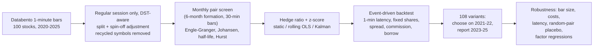

## Data

- **Source.** Databento Nasdaq TotalView-ITCH 1-minute OHLCV bars for {{n_tickers}} US stocks, {{first_day}} to {{last_day}} ({{n_days}} trading days).
  - The tickers cover 21 hand-labelled industries, such as semiconductors, bitcoin miners, interactive media, pharma, fintech and solar.
  - See `data/README.md`.
- **Regular session only, DST-aware.** The vendor files stop at 20:00 UTC. That is 16:00 New York time in summer but 15:00 in winter, so {{n_winter}} standard-time days lack the last trading hour for every stock.
  - Each day's session end is detected from the data, and no bar spans the gap.
  - The final hour's return on those days is part of the overnight move.
- **Corporate actions.** {{n_splits}} splits and spin-offs are back-adjusted, e.g. GOOGL 20-for-1 (fig. 10), NVDA, AVGO and reverse splits.
  - Every overnight move above 45% is audited in `results/data_split_audit.csv`. This audit found one split missing from the Yahoo history (NVO, 2-for-1, 2023).
- **Recycled symbols.** `META` belonged to a Roundhill ETF until 9 June 2022, and `BHVN` passed to Biohaven's spin-off in October 2022. Data before those dates is dropped.
- **Cross-check.** On full-session days the last regular-session trade matches Yahoo's official close to within a median of {{yahoo_bps}} bps.

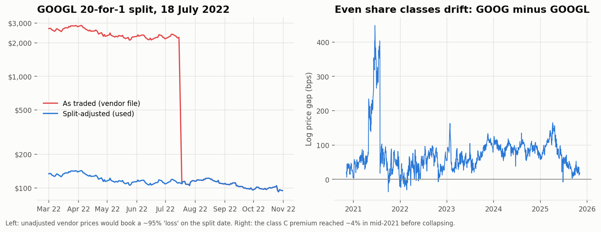

## 1 · Pair selection (every month, point-in-time)

1. **Formation window.** The previous 6 months of **30-minute** log prices, split-adjusted.
   - Unit-root test power depends on the calendar span rather than the sampling frequency, so one selection bar size serves every trading frequency.
2. **Universe.** Stocks that traded on at least 95% of formation days, with a median price of at least $3 and a median Nasdaq dollar volume of at least $5M per day. Everything is measured inside the window.
3. **Candidates.** Every pair of universe stocks in the same industry.
4. **Engle-Granger test** in both orderings. The pair's p-value is 2x the smaller one (Bonferroni for the two orderings).
5. **Eligibility.** A pair must have p <= 5%, a Johansen trace test that rejects no cointegration, an Ornstein-Uhlenbeck half-life between 2 hours and 10 days, a Hurst exponent below 0.5, and a hedge ratio between 0.2 and 5.
   - The Johansen test puts the constant inside the cointegrating relation. Its critical values are checked by simulation in `tests/`.
6. **Ranking.** Pairs are ranked by p-value. Up to **5 pairs** are traded, with no stock in more than 2 of them.

{{table_funnel}}

On average only **{{avg_pairs}} pairs** qualify per month, so about {{util}} of capital is deployed. {{months_none}} of {{n_months}} months have no pair at all.

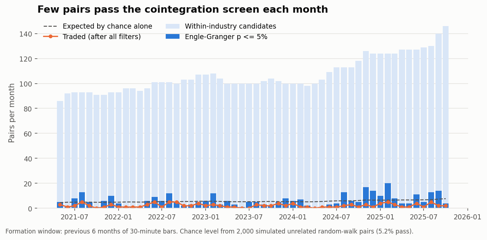
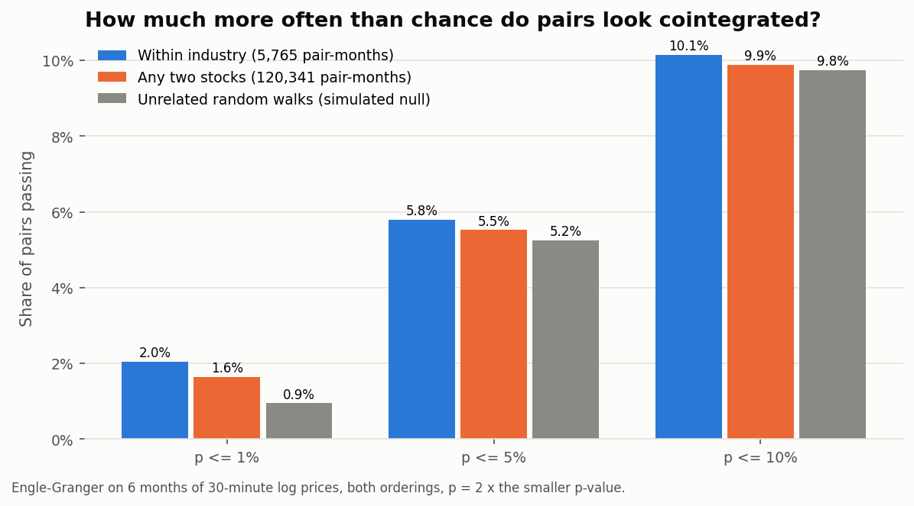

**Does cointegration persist?** Each pair was re-tested on the following 6 months (out of sample for the test itself):

{{table_persist}}

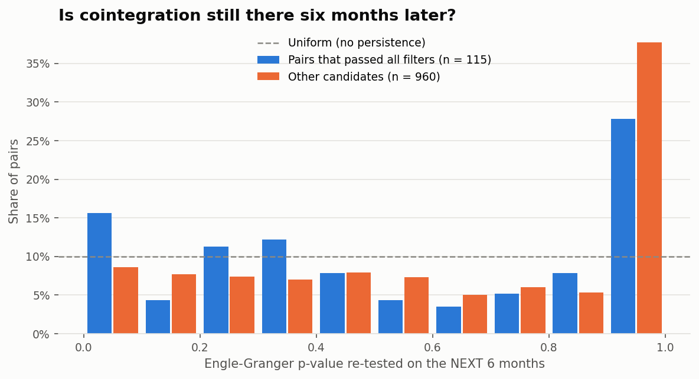

## 2 · Backtest design

- **Walk-forward.** Pairs chosen at the start of month *m* trade only during month *m*, and every position is closed at the month-end close.
- **Signals.** Z-score of the spread `log P_y - beta * log P_x`, with three hedge-ratio methods:
  - *static*: formation OLS;
  - *rolling*: OLS over the previous 10 trading days (at least 20 bars, so 20 days for daily bars), with the current bar scored out of sample;
  - *Kalman*: random-walk state for the hedge ratio and mean, with noise scaled so the filter has about a 10-day memory at any bar size.
- **Rules.**
  - Enter when |z| exceeds the entry threshold.
  - Exit when z crosses back through the exit threshold, at a stop-loss (|z| >= entry + 2), after 3 formation half-lives, or at month end.
  - After a stop, the pair can re-enter only once |z| is back inside the entry band.
- **Execution.**
  - The signal uses the bar's close.
  - The order fills at the **close of the next 1-minute bar**, i.e. the next traded price. Month-end exits use the closing price.
  - Share quantities are fixed at entry ($1 long : $beta short, gross exposure 2x slot capital) and never rebalanced mid-trade.
- **Costs**, per leg and per fill:
  - half-spread, estimated monthly with the Abdi-Ranaldo estimator on 1-minute bars and floored at half a tick;
  - $0.0035 per share commission;
  - 1 bp impact;
  - plus a 1% p.a. borrow fee on the short leg.
- **Returns.** Daily P&L on committed capital, excluding interest on that capital. It is therefore an excess return, and the Sharpe ratio uses no risk-free deduction.
- **Protocol.** {{n_trials}} variants: 6 bar sizes (1 min to 1 day) x 3 hedge methods x entry |z| in {1.5, 2, 2.5} x exit |z| in {0, 0.5}.
  - The grid, the selection rules and the cost model were fixed before any backtest.
  - The variant with the best **validation** (2021-05 to 2022-12) net Sharpe is reported **out of sample** (2023-01 to 2025-10).

## 3 · Results

Chosen on validation: **{{config}}**. It made {{n_trades}} trades ({{tpm}} per month), won {{win}} of them, and held for a median of {{hold_days}} calendar days.
- Gross P&L per trade fell from {{gross_bps_val}} bps of the position's gross notional in validation to {{gross_bps_oos}} bps out of sample. Costs averaged {{cost_bps}} bps.
- Exits: {{exit_rev}} reversion, {{exit_stop}} stop-loss, {{exit_time}} time stop, {{exit_me}} month end.

{{table_perf}}

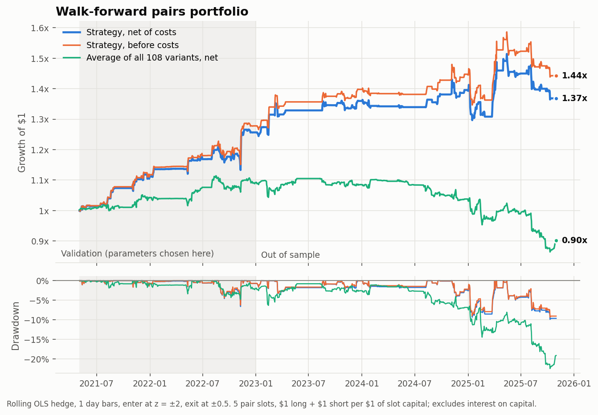

**Validation vs out of sample for all {{n_trials}} variants.** Most variants that looked good in 2021-22 lost money afterwards:

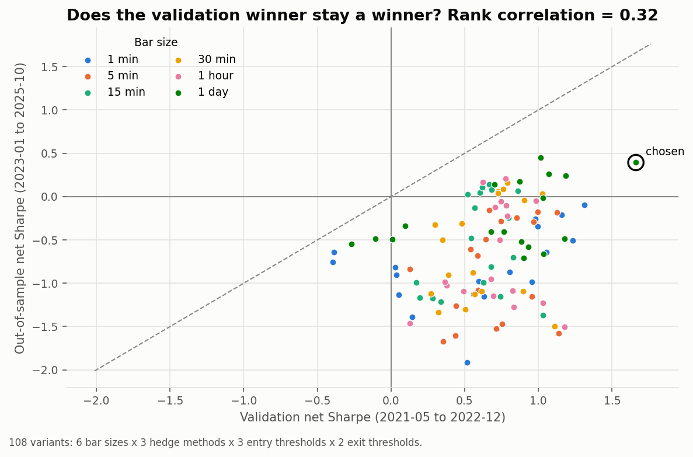

Top variants by validation Sharpe:

{{table_top}}

{{table_years}}

## 4 · What drives the result?

**Bar size.** The same pairs are traded with signals and fills at each bar size. Columns marked * use the chosen entry/exit rules.

{{table_bars}}

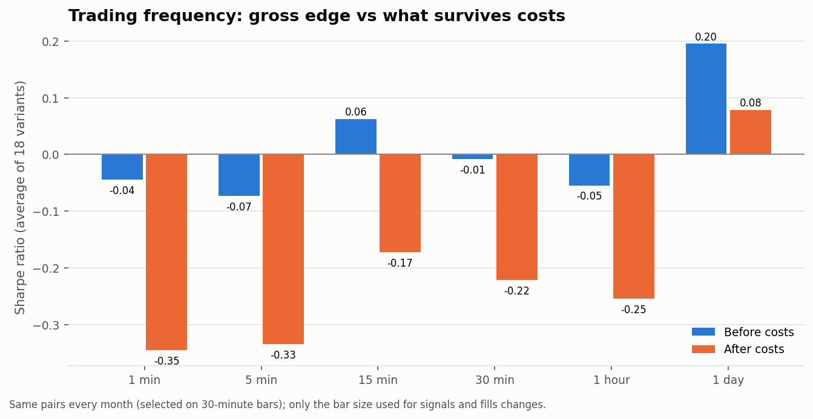

**Hedge-ratio method** (average of variants):

{{table_hedge}}

**Costs.** Net Sharpe of the chosen strategy as all trading costs are scaled:

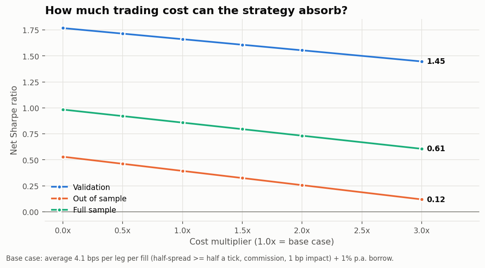

**Execution latency** (chosen strategy). With daily bars, "one minute after the close" means the next morning's first trade:

{{table_latency}}

**Pair selection vs placebo.** The trading rules stay identical and only the choice of pairs changes. The "any industry" screen was *not* chosen: its validation Sharpe was only {{unc_val}}. Its strong out-of-sample number is a hypothesis for further testing, not a result.

{{table_selection}}

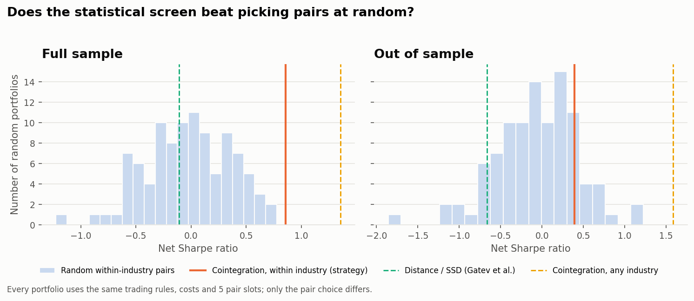

**By industry** (chosen strategy, net P&L as % of capital):

{{table_industry}}

## 5 · Example: GOOG vs GOOGL

The two Alphabet share classes are the textbook "pair". They still drift apart, and the class C premium reached about 4% in mid-2021 (fig. 10). Below is the chosen strategy's busiest out-of-sample pair-month:

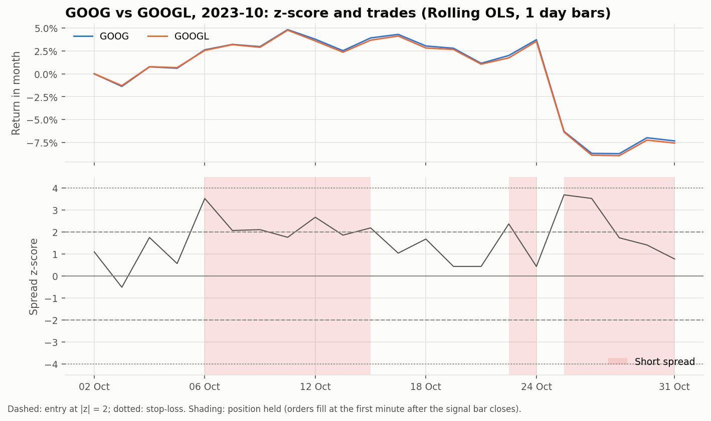

## Biases handled

| Pitfall | How this project handles it |
|---|---|
| Look-ahead in signals | Signals use data up to the bar close and fills happen one minute later. A unit test perturbs future prices and checks that no past decision changes. |
| Selection look-ahead | Pairs, hedge ratios, half-lives and cost estimates come only from data before the trading month. |
| Data snooping | 108 variants were fixed in advance, chosen on validation only, and reported out of sample. The deflated Sharpe ratio and the average of all variants are reported too. |
| Multiple testing in pair selection | Direction-adjusted p-values, a comparison with a simulated null, Benjamini-Hochberg discovery counts, and a random-pair placebo. |
| Unadjusted or wrong prices | Split and spin-off adjustment, an audit of large overnight moves, recycled symbols dropped, and a cross-check against Yahoo closes. |
| Unrealistic costs | Spreads are floored at half a tick, plus per-share commission, impact and borrow fees, with a cost sensitivity and break-even analysis. |

## Limitations

- **Universe.** The 100 stocks were chosen in 2025. They are liquid, often volatile names, and their selection may favour stocks that became popular, a mild survivorship bias. Industry labels are hand-assigned from current business lines.
- **Single venue.** Nasdaq-only (ITCH) trades understate volume and can differ from consolidated prices by a tick. There are no quotes, so spreads are estimated from bars.
- **Missing final hour.** The final trading hour is missing on standard-time days (see Data). Positions are held through it, so that hour's return is effectively part of the overnight move.
- **Sample size.** Out-of-sample inference rests on under 3 years of daily P&L from about 2 pairs at a time. Every Sharpe confidence interval is wide.
- **Scope.** There is no earnings-date filter and no short-sale availability data. Borrow is a flat 1% p.a., which is optimistic for hard-to-borrow names.
- **Dividends are not adjusted for.** This matters most for dividend payers held over an ex-date, such as pharma, banks and food; the effect partly cancels between the long and short legs.
- **Spread estimates.** The 1-minute Abdi-Ranaldo estimate is often zero, and then the half-tick floor sets the cost. With quote data, the spread could be measured directly.

## Reproduce

```bash
pip install -r requirements.txt
python scripts/download_data.py --databento-key YOUR_KEY   # minute bars (paid), Yahoo splits/closes, factors
# (already have the CSVs? set PAIRS_MINUTE_DIR=/path/to/csvs and run download_data.py --skip-minute)
python scripts/build_data.py                               # ~2 min: clean minute panel -> data/processed/
python scripts/run_pipeline.py                             # ~20 min: selection, 108-variant grid, experiments
python scripts/make_readme.py                              # refresh README numbers
python tests/test_pairs.py                                 # or: pytest tests
```

```
src/pairs/
  data.py        CSV parsing, session detection, split adjustment, minute panel, resampling + fill prices
  coint.py       ADF, Engle-Granger, Johansen (from scratch), half-life, Hurst, Benjamini-Hochberg
  selection.py   point-in-time universe, candidate pairs, monthly screen and ranking rules
  hedge.py       static OLS, rolling OLS and Kalman-filter hedge ratios and z-scores
  backtest.py    vectorised event-driven backtester (fills, fixed shares, costs, borrow, trade log)
  costs.py       Abdi-Ranaldo spread estimator and per-leg cost model
  pipeline.py    cached compute stages; analysis.py tables and figures; stats.py inference helpers
notebooks/       walkthrough notebook (reads results/)
results/         CSV tables + figures
tests/           statistical tests vs Monte Carlo, no-look-ahead and P&L accounting tests
```

## References

- Engle & Granger (1987), *Co-integration and Error Correction*, Econometrica.
- Johansen (1991), *Estimation and Hypothesis Testing of Cointegration Vectors*, Econometrica. MacKinnon, Haug & Michelis (1999), *Numerical Distribution Functions of Likelihood Ratio Tests for Cointegration*, JAE.
- MacKinnon (1994, 2010), approximate p-values and critical values for unit-root and cointegration tests.
- Shiller & Perron (1985), *Testing the Random Walk Hypothesis: Power versus Frequency of Observation*, Economics Letters.
- Gatev, Goetzmann & Rouwenhorst (2006), *Pairs Trading: Performance of a Relative-Value Arbitrage Rule*, RFS.
- Avellaneda & Lee (2010), *Statistical Arbitrage in the US Equities Market*, Quantitative Finance.
- Chan (2013), *Algorithmic Trading: Winning Strategies and Their Rationale* (Kalman-filter pairs).
- Abdi & Ranaldo (2017), *A Simple Estimation of Bid-Ask Spreads from Daily Close, High, and Low Prices*, RFS.
- Benjamini & Hochberg (1995); Bailey & López de Prado (2014), *The Deflated Sharpe Ratio*, JPM.
